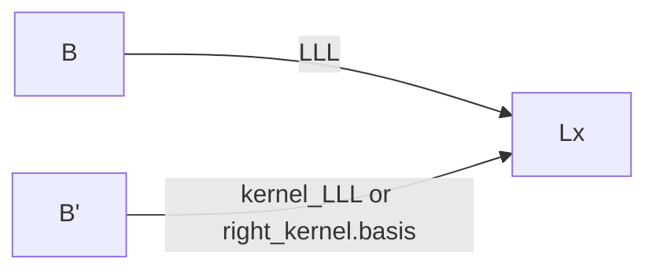

# 两个格密码相关的狠活
> https://eprint.iacr.org/2021/1007

## 强网杯 2022 Lattice

逻辑


$$
C = A \sdot B \ \ (mod \ n)\\
B \to LLL \to L_x
$$
已知C求Lx

构造A矩阵

I 是单位矩阵


```python
A = matrix(ZZ,m+r,m+r)
for i in range(m):
  A[i,i] = 1
for i in range(r):
  for j in range(m):
    A[j,i+m] = C[i,j]<<200
  A[i+m,i+m] = N<<200
```


$$
A \to LLL \to S
$$


满足

S*A得到最得到短基
$$
此时有 B'*C^t+K*N=0
$$


得到的B’如下操作得到  Lx




## 巅峰极客2022 

> 狠活https://crypto.stackexchange.com/a/70508

逻辑


已知Q求m，说实话，太逆天了。。。。只记录步骤

可以理解为想办法构造一个格子，让它的规约后得到的最短基组的第一列刚好为m 所以上文才要转置吗23333

主要思想是先找Q = D*G


di是生成元G与Qi的离散对数解

然后找一个矩阵R使得


R的计算

构造


左上得到R

由于有


（这也能解？）

所以M的每一列是矩阵R的右核解，我们要求的M的第一列是R的右核格上。

格基规约后的每行正交性是不变的。且M的第一列是短向量，期望对R求右核矩阵然后规约即可还原出M的第一列。（没看懂）

```python
M=Matrix(ZZ,74,74)
for i in range(73):
    M[i,i]=1
    M[i,-1]=D[i]
M[-1,-1]=p
R=M.LLL()
LK=[]
# 这是在取结果的右核吗？
for i in R:
    if i[-1]!=0:
        break
    else:
        LK.append(i[:-1])
print(len(LK))

# 用R的右核解M
LK=Matrix(ZZ,LK)
key=Matrix(ZZ,LK.right_kernel().basis()).LLL()[0]
for i in key:
    print(chr(long_to_bytes(ZZ(i))[-1]),end='')
```

