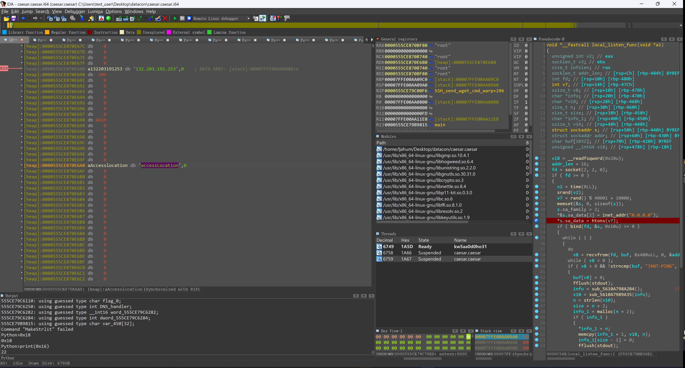
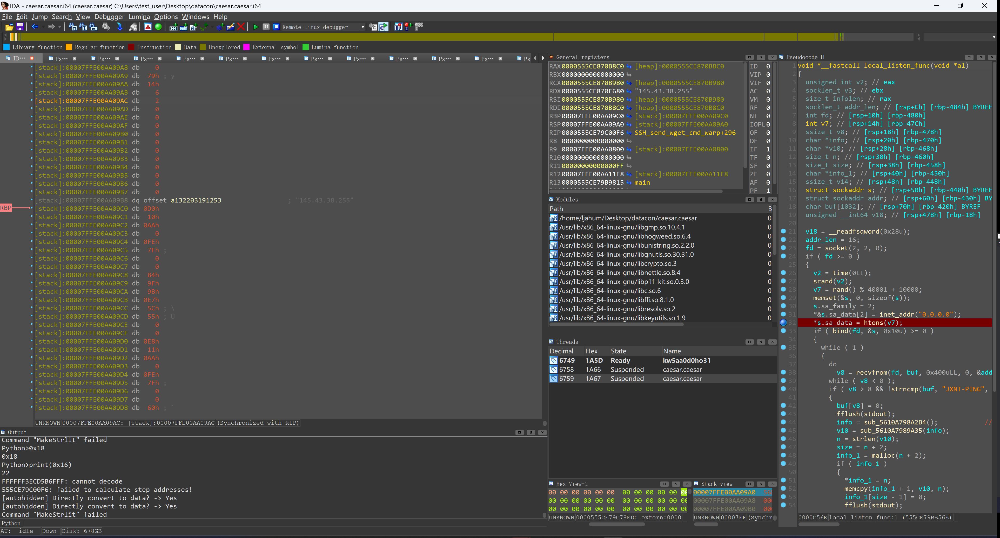

nc -s  192.168.244.128 16996


[stack]:00007FFE00AA0A50 db 0E4h
[stack]:00007FFE00AA0A51 db  0Ah
[stack]:00007FFE00AA0A52 db 0AAh
[stack]:00007FFE00AA0A53 db    0
[stack]:00007FFE00AA0A54 db 0FEh
[stack]:00007FFE00AA0A55 db  7Fh ; 
[stack]:00007FFE00AA0A56 db    0
[stack]:00007FFE00AA0A57 db    0
[stack]:00007FFE00AA0A58 db  7Ch ; |
[stack]:00007FFE00AA0A59 db  93h
[stack]:00007FFE00AA0A5A db 0CDh
[stack]:00007FFE00AA0A5B db 0ACh
[stack]:00007FFE00AA0A5C db 0F1h
[stack]:00007FFE00AA0A5D db  7Fh






```


179.195.95.254
192.113.0.13
82.169.180.195
195.33.171.192
62.32.233.192
146.199.105.206
52.25.241.168
```

2

```
"175.110.34.252"
"88.84.239.253"
"193.9.217.122"
"82.220.40.207"
"123.28.226.72"
67.131.199.250
"87.146.60.94"
```

ssh


用户列表

```
[heap]:0000556788ECC30F db    0
[heap]:0000556788ECC310 off_556788ECC310 dq offset aRoot        ; "root"
[heap]:0000556788ECC318 dq offset aRoot_0                       ; "root"
[heap]:0000556788ECC320 dq 404000A0000h
[heap]:0000556788ECC328 dq offset aDefault                      ; "default"
[heap]:0000556788ECC330 dq offset byte_556788EB0800
[heap]:0000556788ECC338 dq 70013000Ah
[heap]:0000556788ECC340 dq offset aAdmin                        ; "Admin"
[heap]:0000556788ECC348 dq offset aAdmin_0                      ; "admin"
[heap]:0000556788ECC350 dq 505001B0013h
[heap]:0000556788ECC358 dq offset aRoot_1                       ; "Root"
[heap]:0000556788ECC360 dq offset aVizxv                        ; "vizxv"
[heap]:0000556788ECC368 dq 5040022001Bh
[heap]:0000556788ECC370 dq offset aRoot_2                       ; "Root"
[heap]:0000556788ECC378 dq offset aDefault_0                    ; "default"
[heap]:0000556788ECC380 dq 70400280022h
[heap]:0000556788ECC388 dq offset aE8ehome                      ; "e8ehome"
[heap]:0000556788ECC390 dq offset aE8ehome_0                    ; "e8ehome"
[heap]:0000556788ECC398 dq 707002D0028h
[heap]:0000556788ECC3A0 dq offset aE8telnet                     ; "e8telnet"
[heap]:0000556788ECC3A8 dq offset aE8telnet_0                   ; "e8telnet"
[heap]:0000556788ECC3B0 dq 8080032002Dh
[heap]:0000556788ECC3B8 dq offset aRoot_3                       ; "Root"
[heap]:0000556788ECC3C0 dq offset aTtnet                        ; "ttnet"
[heap]:0000556788ECC3C8 dq 50400370032h
[heap]:0000556788ECC3D0 dq offset aTelecomadmin                 ; "telecomadmin"
[heap]:0000556788ECC3D8 dq offset aTelecomadmin_0               ; "telecomadmin"
[heap]:0000556788ECC3E0 dq 0C0C003C0037h
[heap]:0000556788ECC3E8 dq offset aTelnet                       ; "telnet"
[heap]:0000556788ECC3F0 dq offset aTelnet_0                     ; "telnet"
[heap]:0000556788ECC3F8 dq 6060041003Ch
[heap]:0000556788ECC400 dq offset aTelecomadmin_1               ; "telecomadmin"
[heap]:0000556788ECC408 dq offset aAdmintelecom                 ; "admintelecom"
[heap]:0000556788ECC410 dq 0C0C00460041h
[heap]:0000556788ECC418 dq offset aSupport                      ; "support"
[heap]:0000556788ECC420 dq offset aSupport_0                    ; "support"
[heap]:0000556788ECC428 dq 707004A0046h
[heap]:0000556788ECC430 dq offset aAdmin_1                      ; "admin"
[heap]:0000556788ECC438 dq offset a1001chin                     ; "1001chin"
[heap]:0000556788ECC440 dq 805004E004Ah
[heap]:0000556788ECC448 dq offset aRoot_4                       ; "root"
[heap]:0000556788ECC450 dq offset aAquario                      ; "aquario"
[heap]:0000556788ECC458 dq 7040051004Eh
[heap]:0000556788ECC460 dq offset aDefault_1                    ; "default"
[heap]:0000556788ECC468 dq offset aDefault_2                    ; "default"
[heap]:0000556788ECC470 dq 70700540051h
[heap]:0000556788ECC478 dq offset aAdm                          ; "adm"
[heap]:0000556788ECC480 dq offset unk_556788EB2C70
[heap]:0000556788ECC488 dq 300570054h
[heap]:0000556788ECC490 dq offset aRoot_5                       ; "root"
[heap]:0000556788ECC498 dq offset aTazz23495859                 ; "taZz@23495859"
[heap]:0000556788ECC4A0 dq 0D0400590057h
[heap]:0000556788ECC4A8 dq offset aRoot_6                       ; "root"
[heap]:0000556788ECC4B0 dq offset aTsgoingon                    ; "tsgoingon"
[heap]:0000556788ECC4B8 dq 904005B0059h
[heap]:0000556788ECC4C0 dq offset aAdmin_2                      ; "admin"
[heap]:0000556788ECC4C8 dq offset aAdmin123                     ; "admin123"
[heap]:0000556788ECC4D0 dq 805005C005Bh
[heap]:0000556788ECC4D8 dq offset aRoot_7                       ; "root"
[heap]:0000556788ECC4E0 dq offset aGm8182                       ; "GM8182"
[heap]:0000556788ECC4E8 dq 604005D005Ch
[heap]:0000556788ECC4F0 dq offset aAdmin_3                      ; "Admin"
[heap]:0000556788ECC4F8 dq offset aGpon                         ; "gpon"
[heap]:0000556788ECC500 dq 405005E005Dh
[heap]:0000556788ECC508 dq offset aRoot_8                       ; "root"
[heap]:0000556788ECC510 dq offset aZte                          ; "zte"
[heap]:0000556788ECC518 dq 304005F005Eh
[heap]:0000556788ECC520 db 0
[heap]:0000556788ECC521 db    0
```

```
1
 dword_556787905284 = htonl(0x41DECA35u);    // IP Address: 65.222.202.53 80
2
169.196.166.199 4264h

000000000000B3B1回调函数
.text:000000000000B3BC                 lea     rax, sub_B3CD
 3
 0x7F000001u 
 172.0.0.1  48101u
 
 
```

```
int func_12345()
{
  int result; // eax

  result = (unsigned __int8)dest[0];
  if ( dest[0] )
  {
    result = strcmp(&s1, "20230230");
    if ( result )
    {
      *(_DWORD *)&addr.sa_data[2] = inet_addr(dest);
      *(_WORD *)addr.sa_data = htons(12345u);
      return sleep(100000u);
    }
  }
  return result;
}
有个12345端口 ip来源start_routine
```

```
.bss:000055F62B1CF283 dd 0CADE4150h                           ; DATA XREF: main+25E↑w
.bss:000055F62B1CF283                                         ; func_12345+39↑w
.bss:000055F62B1CF287 dd 53
```

169.196.166.199 12345


JXNT