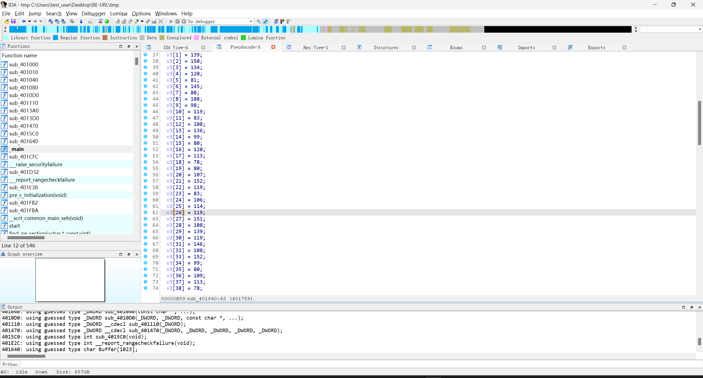

可以在main看到释放ou.exe的过程

调试发现内存中的4D5A，写脚本将内存dump出来

```python

import idaapi
data = idaapi.dbg_read_memory(0x0F70000, 0x1a800)
#print(data)
#exit()
fp = open('C:\\Users\\test_user\\Desktop\\RE-URL\\tmp.txt', 'wb')
fp.write(data)

```

分析tmp文件



进去main函数直接就是对flag解密的操作

调到freeblock的位置又一串base64

```
ZmxhZ3s2NDY5NjE2ZS02MzY5LTYyNmYtNzE2OS03NDYxNzA2MTc3NjF9
```

```
flag{6469616e-6369-626f-7169-746170617761}
```

解密就是flag，但在后面的程序有自己解密了一遍。。。。

## hello py


在package里面找到app.zip


找到资源文件夹

解压app.imy得到文件

py程序虽然做了很让人讨厌的混淆，但看到0x9e3779b9 直接一眼xxtea

找个xxtea脚本解密

```python
from Crypto.Util.number import *
from ctypes import *


def MX(z, y, total, key, p, e):
    temp1 = (z.value>>5 ^ y.value<<2) + (y.value>>3 ^ z.value<<4)
    temp2 = (total.value ^ y.value) + (key[(p&3) ^ e.value] ^ z.value)
    
    return c_uint32(temp1 ^ temp2)


def decrypt(n, v, key):
    delta = 0x9e3779b9
    rounds = 6 + 52//n 
    
    total = c_uint32(rounds * delta)
    y = c_uint32(v[0])
    e = c_uint32(0)

    while rounds > 0:
        e.value = (total.value >> 2) & 3
        for p in range(n-1, 0, -1):
            z = c_uint32(v[p-1])
            v[p] = c_uint32((v[p] - MX(z,y,total,key,p,e).value)).value
            y.value = v[p]
        z = c_uint32(v[n-1])  
        v[0] = c_uint32(v[0] - MX(z,y,total,key,0,e).value).value
        y.value = v[0]  
        total.value -= delta
        rounds -= 1

    return v 


#  test  
if __name__ == "__main__":
	# 该算法中每次可加密不只64bit的数据，并且加密的轮数由加密数据长度决定
    # v = [0x12345678, 0x78563412]
    k = [0x1, 0x2, 0x3, 0x4]
    k = [12345678 ,12398712 ,91283904 ,12378192 ]
    n = 9

    # print("Data is : ", hex(v[0]), hex(v[1]))
    # res = encrypt(n, v, k)
    # print("Encrypted data is : ", hex(res[0]), hex(res[1]))
    res =[689085350 ,626885696 ,1894439255 ,1204672445 ,1869189675 ,475967424 ,1932042439 ,1280104741 ,2808893494 ]#line:85
    res = decrypt(n, res, k)
    # print("Decrypted data is : ", hex(res[0]), hex(res[1]))
    flag =b''
    
    print(res)
    for i in res:
        flag+= long_to_bytes(i)
    print(flag)
```


